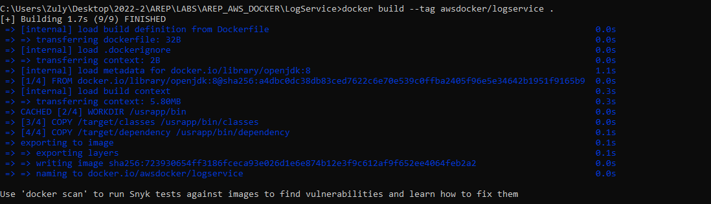
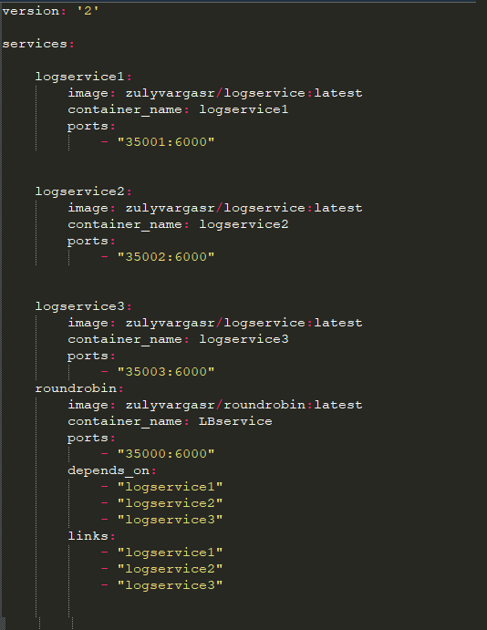
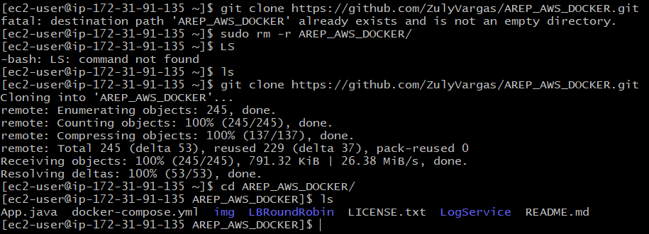

# LABORATORIO MODULARIZACIÓN CON VIRTUALIZACIÓN: DOCKER Y A AWS

1. El servicio MongoDB es una instancia de MongoDB corriendo en un container de docker en una máquina virtual de EC2
2. LogService es un servicio REST que recibe una cadena, la almacena en la base de datos y responde en un objeto JSON con las 10 ultimas cadenas almacenadas en la base de datos y la fecha en que fueron almacenadas.
3. La aplicación web APP-LB-RoundRobin está compuesta por un cliente web y al menos un servicio REST. El cliente web tiene un campo y un botón y cada vez que el usuario envía un mensaje, este se lo envía al servicio REST y actualiza la pantalla con la información que este le regresa en formato JSON. El servicio REST recibe la cadena e implementa un algoritmo de balanceo de cargas de Round Robin, delegando el procesamiento del mensaje y el retorno de la respuesta a cada una de las tres instancias del servicio LogService.

## Arquitectura:

	

## Cómo empezar

A continuación podrá encontrar los pasos ccon los cuales puede acceder al sitio web o usar el proyecto de manera local.

### Prerrequisitos

* [Maven](https://maven.apache.org/) - Administrador de dependencias
* [Java ](https://www.oracle.com/co/java/technologies/javase/javase-jdk8-downloads.html)       Ambiente de desarrollo
* [Git](https://git-scm.com/) - Sistema de control de versiones

### Instalación

Para descargar el proyecto ejecute 

   git clone https://github.com/ZulyVargas/AREP_AWS_DOCKER.git

## Documentación
Para generar la documentación se debe ejecutar:

    mvn javadoc:javadoc

Esta quedará en la carpeta target/site/apidocs :

O diríjase a la siguiente dirección: 
* [Documentación]()

## Construido con 

* [Maven](https://maven.apache.org/) - Administrador de dependencias
* [Heroku](https://heroku.com) - Plataforma de despliegue

## DESARROLLO PASO A PASO

1. Para realizar los contenedores correspondientes es necesario primero que todo crear los Dockerfile para cada servicio.
2. Luego de creados los servicios se crean las imagenes con el comando **docker build**:

LBRoundRobin:

    docker build --tag awsdocker/roundrobin .

LogService:

Para este ejercicio se crearan 3 instancias para LogService. Primero se construye la imagen:
    
    docker build --tag awsdocker/logservice .

Se crea el archivo docker-file.compose para crear los contenedores correspondientes:

Verificamos en Docker los contenedores creados:

Se ingresa un nuevo mensaje:

Se verifica que se recargan las cadenas ingresadas:

### AWS:

Para que la aplicación creada funcione desplegada en aws se deben subir las imagenes creadas localmente a un repositorio de Docker.

Primero se usan los siguientes comandos para vincular las imagenes:

    docker tag awsdocker/roundrobin zulyvargasr/roundrobin
    docker tag awsdocker/logservice zulyvargasr/logservice

Luego se suben a los respositorios:

    docker push zulyvargasr/roundrobin:latest
    docker push zulyvargasr/logservice:latest

  

Verificación en Docker Hub:

Se debe modificar el nombre de las imagenes en el docker compose para que estas sean tomadas en línea y no localmente como se probó anteriormente:

 

Para el despliegue en AWS se ingresa a la consola dada por el portal educativo, se inicia el laboratorio y se da sobre AWS cuando esta se active. Luego de esto se busca entre los diferentes servicios  EC2:

 

Lanzar instancia -> Buscas -> Seleccionar

 

Se crea un nuevo par de llaves y se descarga:

Configuamos los puertos:

Nos conectamos a la máquina:

Se usan los siguientes comandos para descargar y correr Docker en la máquina virtual:

    sudo yum install docker
    sudo service docker start 
    sudo usermod -a -G docker ec2-user
    exit
Al volver a generar la conexión los cambios realizados tendrán efecto.

Para construir la aplicación nuevamente ya en AWS, se deben obtener las imagenes, para esto se clonará el repositorio y mediante docker compose el cual debe ser instalado se desplegará:

Para instalar git en EC2: https://cloudaffaire.com/how-to-install-git-in-aws-ec2-instance/

Para instalar el comando docker-compose: https://gist.github.com/npearce/6f3c7826c7499587f00957fee62f8ee9

Clonamos el repositorio y ejecutamos docker-compose en la ubicación de la carpeta:

    docker-compose up -d

Entramos al navegador con el puerto asociado:

    http://ec2-54-88-224-69.compute-1.amazonaws.com:35000/

Se verifica que se pueda guardar un nuevo mensaje:

## Autores

**Zuly Valentina Vargas Ramírez** 

## Licencia

Este proyecto esta bajo la licencia GNU(General Public License) los detalles se encuentran en el archivo [LICENSE](LICENSE.txt).
